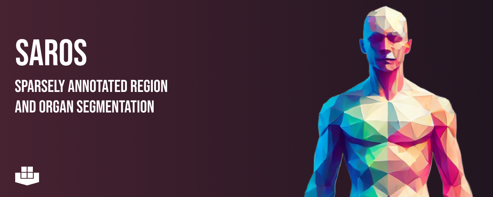

<!-- PROJECT LOGO -->


# Download

1. Install the package manager [poetry](https://python-poetry.org/docs/#installation)

2. Clone the repository
```shell
git clone https://github.com/UMEssen/saros-dataset
cd saros-dataset
```

3. Install the dependencies
```shell
poetry install --no-dev
```

4. Download the NIfTI segmentations from [TCIA](https://doi.org/10.25737/sz96-zg60), this needs the Aspera plugin. The download should be rather fast.

5. Extract the archive and rename the directory to any name you like (e.g. `data`). The `data` in the repository directory is the default name where the CT data will be stored, but it can be changed with the `--target-dir` parameter of `download.py`. If you want the segmentations and the data to be in the same folder, set `--target-dir` to the directory where the segmentations are stored, or change the name of the extracted directory to `data` and put it in the repository directory. **Note**: We recommend to run the download of the images in the same folder as the segmentations because some sanity checks are run to ensure that image and segmentation are compatible.

6. Download the Segmentation Information Spreadsheet and either put it in the repository directory or use the `--info-csv` parameter to specify its location.

7. Run the download script
```shell
poetry run python3 download.py
```

By default, the CTs and the segmentations will be downloaded as NIfTIs and resampled to 5mm thickness.

Please note that not all collections are freely available for download. Most collections can be accessed by [creating an account on TCIA](https://wiki.cancerimagingarchive.net/pages/viewpage.action?pageId=23691309). For the following collections you will need to separately ask for access by filling [TCIA Restricted License Agreement](https://wiki.cancerimagingarchive.net/download/attachments/4556915/TCIA%20Restricted%20License%2020220519.pdf?version=1&modificationDate=1652964581655&api=v2) and by sending it to [help@cancerimagingarchive.net](mailto:help@cancerimagingarchive.net):
* [Head-Neck Cetuximab](https://wiki.cancerimagingarchive.net/display/Public/Head-Neck+Cetuximab)
* [ACRIN-HNSCC-FDG-PET/CT](https://wiki.cancerimagingarchive.net/pages/viewpage.action?pageId=52763679)
* [QIN-HEADNECK](https://wiki.cancerimagingarchive.net/display/Public/QIN-HEADNECK)
* [TCGA-HNSC](https://wiki.cancerimagingarchive.net/pages/viewpage.action?pageId=11829589)
* [HNSCC](https://wiki.cancerimagingarchive.net/display/Public/HNSCC)
* [Anti-PD-1_MELANOMA](https://wiki.cancerimagingarchive.net/pages/viewpage.action?pageId=37225348)

### Command Line Parameters
* `--info-csv`: The path to the CSV file containing the information about the collections to download, this file can be downloaded from our TCIA collection. If not present, the current directory and the filename `Segmentation Info.csv` will be used.
* `--target-dir`: The directory where the CTs and the segmentations should be stored.
* `--save-original-image`: If present, the original CT (not resampled) will be saved in the target directory with the name `image_original.nii.gz`.
* `--save-meta-dicoms`: If present, the first and the last DICOM files containing DICOM meta data will be stored.
* `--save-dicoms`: If present, all DICOMs will be stored.
* `--force-download`: If present, the download will be downloaded even if the target directory already exists.
* `--no-login`: If present, the user will not be asked to login to TCIA.
* `--parallel-downloads`: The number of parallel downloads (default: 2), please use this value carefully in order not do overload the TCIA servers.

## Notes
There are three CTs (`case_609`, `case_623`, `case_816`) that have abnormal CT values (e.g. -3000 HU). Be sure to take this into account when training your CNN models.

# Training
As an example of how to use our dataset, we have trained and evaluated two 2D [nnUNet](https://github.com/MIC-DKFZ/nnUNet) models for the body regions and the body parts.

1. Download the data as described above. You should now have a directory that contains all cases and that looks as follows:
```
data/
├── case_000/
│   ├── image.nii.gz
│   ├── body-regions.nii.gz
│   ├── body-parts.nii.gz
├── case_001/
├── ...
```
2. Clone this repository and install the dependencies.
```bash
git clone git@github.com:UMEssen/saros-dataset.git
cd saros-dataset
poetry install --no-root
poetry shell # Activate the virtual environment
```
3. Clone nnUNet and install the dependencies.
```bash
git clone git@github.com:MIC-DKFZ/nnUNet.git
cd nnUNet
pip install . # Make sure you are in the poetry environment
cd ..
```
4. Run the [move_data.py](training/move_data.py) script to move the data to the nnUNet format.
```bash
python training/move_data.py --source-root data --target-root . --dataset regions --info-csv Segmentation-Info_09-29-2023.csv
python training/move_data.py --source-root data --target-root . --dataset parts --info-csv Segmentation-Info_09-29-2023.csv
```
5. Train the models.
```bash
bash training/train_parts.sh
bash training/train_regions.sh
```
6. Install the surface-distance package.
```bash
git clone git@github.com:google-deepmind/surface-distance.git
cd surface-distance
pip install . # Make sure you are in the poetry environment
cd ..
```
7. Compute the predictions and evaluate the models.
```bash
bash training/predict_evaluate_parts.sh
bash training/predict_evaluate_regions.sh
```

# Citation

If you use this dataset, please cite:

```
Koitka, S., Baldini, G., Kroll, L., van Landeghem, N., Haubold, J., Sung Kim, M., Kleesiek, J., Nensa, F., & Hosch, R. (2023). SAROS - A large, heterogeneous, and sparsely annotated segmentation dataset on CT imaging data (SAROS) (Version 1) [Data set]. The Cancer Imaging Archive. https://doi.org/10.25737/SZ96-ZG60
```

```
Clark, K., Vendt, B., Smith, K., Freymann, J., Kirby, J., Koppel, P., Moore, S., Phillips, S., Maffitt, D., Pringle, M., Tarbox, L., & Prior, F. (2013). The Cancer Imaging Archive (TCIA): Maintaining and Operating a Public Information Repository. In Journal of Digital Imaging (Vol. 26, Issue 6, pp. 1045–1057). Springer Science and Business Media LLC. https://doi.org/10.1007/s10278-013-9622-7
```
